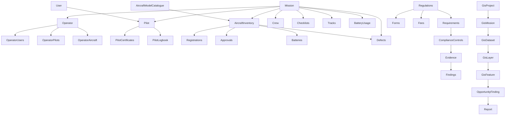

# Domain Relationship Audit

Date: 2026-09-12

## Canonical Target



## Actual Relationships

| Relationship | Status | Evidence | Notes |
|---|---|---|---|
| User -> Pilot | PRESENT | `uas_pilots.user_id`; `UasPilot::user()` | Link exists but onboarding/self-service resolution is incomplete. |
| User -> Roles | PRESENT | `uas_role_user`; `UasRole::users()` | Custom UAS roles exist; not Spatie. |
| Pilot -> Certificates | PRESENT | `pilot_certificates.uas_pilot_id`; `PilotCertificate::pilot()` | Used by pilot compliance and expiry notification planning. |
| Pilot -> Logbook | PRESENT | `pilot_log_entries.uas_pilot_id`; `PilotLogbookSummary` | Entries exist, but post-flight does not automatically update them. |
| Aircraft -> Registrations | PRESENT | `aircraft_registrations.uas_aircraft_id`; `UasAircraft::registrations()` | Registration lifecycle is recorded separately from aircraft master row. |
| Aircraft -> Approvals/UASLA | PRESENT | `aircraft_approvals.uas_aircraft_id`; `UasAircraft::approvals()` | Used by mission release gate. |
| Aircraft -> Batteries | PRESENT/PARTIAL | `uas_batteries.compatible_uas_aircraft_id`; `UasAircraft::batteries()` | Battery is linked as compatible inventory, not created from package catalogue. |
| Aircraft -> Defects | PRESENT | `uas_aircraft_defects.uas_aircraft_id`; `UasAircraft::defects()` | Defect reporting can affect aircraft serviceability. |
| Aircraft -> Catalogue Model | MISSING | No drone manufacturer/model/variant catalogue tables found | Critical onboarding and deduplication gap. |
| Mission -> Pilot | PRESENT | `uas_missions.uas_pilot_id`; `UasMission::pilot()` | Mission references pilot instead of copying pilot details. |
| Mission -> Aircraft | PRESENT | `uas_missions.uas_aircraft_id`; `UasMission::aircraft()` | Mission references aircraft instead of copying registration/model. |
| Mission -> Operator | PRESENT | `uas_missions.uas_operator_id`; `UasMission::operator()` | Nullable for legacy missions; new membership-user mission creation requires accessible operator context. |
| Mission -> Crew | PRESENT | `uas_mission_crew_members.uas_mission_id`; optional pilot/user links | Crew assignments can reference pilot and user. |
| Mission -> Checklist | PRESENT | `uas_mission_checklists.uas_mission_id` | Pre/post-flight forms are mission-scoped. |
| Mission -> Tracks | PRESENT | `uas_flight_tracks.uas_mission_id` | Track references exist; device ingestion is missing. |
| Mission -> Battery Usage | PRESENT | `uas_mission_battery_usages.uas_mission_id` and `uas_battery_id` | Usage references existing batteries and updates usage data. |
| Mission -> Defects | PRESENT | `uas_aircraft_defects.uas_mission_id` nullable | Mission defects tie back to selected aircraft. |
| Operator -> Certificate Cases | PRESENT | `uas_operator_certificate_cases.uas_operator_id` | Application/renewal pack uses these cases. |
| Operator -> Manual Revisions | PRESENT | `uas_operations_manual_revisions.uas_operator_id` | Manual distribution/acknowledgement hangs from revisions. |
| Operator -> Users/Pilots/Aircraft | PRESENT | `uas_operator_memberships`, `uas_operator_pilots`, `uas_operator_aircraft` | First-class membership/assignment pivots now support operator tenancy and mission scoping. |
| Requirement -> Training Links | PRESENT | `uas_training_compliance_links.regulatory_requirement_id` | Regulatory traceability exists for training compliance links. |
| Requirement -> Findings/Notifications/Audits | PRESENT | `requirement_id` links on findings, notifications and audit entries | Source traceability is available but not complete everywhere. |
| Forms/Fees -> Application Pack | INDIRECT | `ApplicationRenewalPackReport` resolves active forms/fees by transaction | No immutable prepared-pack snapshot yet. |
| Compliance Finding -> Corrective Action | PARTIAL | `recommended_action` text on findings | No first-class corrective action lifecycle table found. |
| Document/Evidence -> Domain Records | PARTIAL | `RegulatoryDocument` morph plus many `evidence_references` JSON fields | Evidence is not yet a unified governed attachment architecture. |
| GIS Project -> Mission | PRESENT | `uas_gis_project_missions.uas_gis_project_id`, `uas_mission_id` unique | GIS deliverable intent is separate from flight mission. |
| GIS Mission -> Dataset -> Layer -> Feature -> Opportunity/Finding | PRESENT | Phase 5 GIS migrations/models through FR-GIS-004 | Report and evidence attachment layers are still missing. |

## Data Duplication Findings

| Area | Status | Evidence | Assessment |
|---|---|---|---|
| Mission pilot/aircraft | HEALTHY | `uas_missions` stores `uas_pilot_id` and `uas_aircraft_id` | Follows enter-once/reference-everywhere for core mission assignment. |
| Mission presentation | DELIBERATE READ MODEL | `MissionPresenter` returns aircraft registration/model and pilot name | Presentation duplication only, not persisted. |
| Pilot log entries | SNAPSHOT/PARTIAL | `pilot_log_entries.aircraft_registration` | Likely deliberate historical logbook snapshot, but should be documented. |
| Aircraft inventory | DUPLICATED MASTER DATA | `uas_aircraft.manufacturer`, `model`; `uas_batteries.manufacturer`, `model` | No model catalogue means product specifications are duplicated per asset. |
| Operator approved aircraft/pilots | DUPLICATED/PARTIAL | Operator profile stores approved aircraft/pilots as structured data | Needs first-class relationship to existing pilots/aircraft. |
| Regulatory source text | MIXED | Many actions carry requirement ID/source strings | Good traceability habit, but should resolve to registered `RegulatoryRequirement` where possible. |
| Evidence | FRAGMENTED | JSON evidence fields across records plus `RegulatoryDocument` morph | Needs one governed evidence/document linkage model. |

## Ownership and Isolation

Current permissions are role-permission based and route protected by `auth`. Policies check broad permissions such as `gis.view`, `missions.update` and regulatory permissions. Pilot self-ownership and operator membership are now first-class for their remediation slices, with mission and aircraft listing scoped by active operator membership where applicable.

Residual P1 security risk: API resources, GIS lists, documents/evidence and compliance findings still need explicit object scoping before external/mobile exposure.

Benchmark note: AB4IRERP demonstrates mature permission middleware and feature tests, while the clinic backend demonstrates persona-specific mobile middleware. YAW should combine those ideas with stronger aviation object ownership rather than relying on role permission strings alone.

## Integration Gaps

- User registration does not automatically create or guide creation of a pilot identity.
- Operator now owns users, pilots, aircraft and missions through first-class relationships; GIS, findings and documents still need stronger derived scoping.
- Mission release gate does not yet include operator certificate/OpsSpec, risk assessment, checklist completion, battery eligibility or training competency.
- Post-flight does not propagate to pilot logbook, aircraft folio, battery cycles, maintenance counters and compliance evidence as one integrated workflow.
- Aircraft model catalogue and package/component instantiation are absent.
- Compliance has findings and summaries, but lacks a first-class control/evidence/result model.

## Reference-Driven Relationship Decisions

- Add current-user-to-pilot resolution before API/mobile work.
- Operator membership tables have been added before exposing operator, aircraft, mission or GIS list APIs.
- Add a governed evidence vault adapted from AB4IRERP's document library pattern instead of expanding fragmented JSON evidence fields.
- Keep YAW's regulatory requirement/form/fee version links as a stronger domain-specific pattern; do not replace them with generic document metadata.

## Remediation Phase B Update

```text
User -> Operator Membership -> Operator
Operator -> Pilots
Operator -> Aircraft
Operator -> Missions
```

Operator-user, operator-pilot and operator-aircraft pivots now provide the tenancy spine required for API V1 readiness. `Mission -> Operator` is direct for new operator-scoped records through `uas_operator_id`; `Findings` and `Documents` remain partial/derived because they are polymorphic and not yet uniformly operator-owned.
